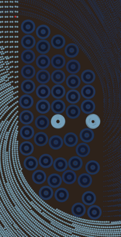
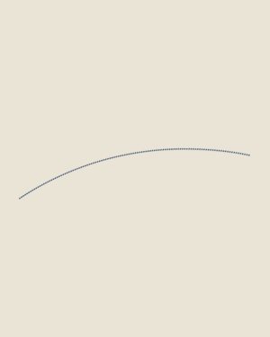

# qqlrs

Alternative renderer for [QQL][] artwork.

This is a from-scratch re-implementation of the QQL algorithm, ported fairly
directly from the original JavaScript source to Rust by [@wchargin][]. Some
notable characteristics:

-   **Compatibility:** This implementation is entropy-compatible with the
    original, using the same RNG algorithms and sampling. A given QQL seed
    should look the same in both implementations (see ["Fidelity
    expectations"][fidelity] for details).

-   **Performance:** Between a faster core (sequential) implementation
    and support for **multicore rendering** of a single QQL, this
    renderer often runs 4–8× faster than the original.

-   **Features:** This implementation has some additional knobs and dials, for
    speed, quality, flexibility, and fun. See ["Features"][features] below.

-   **Hackability:** This code is not obfuscated or minified. Structures and
    dataflow are explicit. There's no hidden or global state. Some components
    have unit tests. Try poking around: read it, play with it, dump
    intermediate data structures, write custom searchers, override variables,
    tweak it yourself. (Just don't suggest that outputs from a tweaked
    algorithm are "official" QQLs, please.)

As a quick, imperfect performance comparison, rendering some QQLs at
9600×12000px on my laptop, across the original JavaScript renderer, this
implementation in sequential mode, and this implementation in parallel
mode (`--chunks 2x4`):

| Piece | Original | Sequential | Parallel | Speedup |
|---|--:|--:|--:|--:|
| [QQL #237][qql237] | 31.57s | 9.84s | 5.86s | **5.4× faster** |
| [QQL #200][qql200] | 53.12s | 22.88s | 8.04s | **6.6× faster** |
| [QQL #198][qql198] | 48.97s | 18.26s | 6.02s | **8.1× faster** |

In addition to the speed improvements, this implementation tends to use
about half as much RAM compared to the original.

[QQL]: https://qql.art
[@wchargin]: https://wchargin.com

[qql237]: https://qql.art/token/0xda3c325ab45b30aeb476b026fe6a777443ca04f38e435bf353adffff10d0430d
[qql200]: https://qql.art/token/0x83d1f3ef47a87d8d33fc4f73cbde3fd4f8f940fe23ae48e68f6bffff10620256
[qql198]: https://qql.art/token/0x83d1f3ef47a87d8d33fc4f73cbde3fd4f8f940fe518da2975d6affff10c1a316

## Attribution

The QQL project and the original art algorithm were created by Tyler Hobbs and
Dandelion Indigo Lee. This implementation was written by @wchargin.

This repository is dual-licensed under Apache 2.0 and MIT terms.

## Getting started

This project uses the standard [Rust][] toolchain. You will need Rust 1.67.0 or
newer. To build:

```shell
$ cargo test --release
$ cargo build --release
```

This creates a binary `target/release/qql-cli`, which you can invoke. In its
most basic form, simply pass a seed that you want to render:

```shell
$ ./target/release/qql-cli 0x33c9371d25ce44a408f8a6473fbad86bf81e1a178c012cd49a85ffff14c54b46
```



Pass any additional options after the seed. For example, to render a
high-resolution version of just the "face" of [QQL #85][qql085], with 8 threads
of parallelism, and save it to a temporary file:

```shell
./target/release/qql-cli \
    0x7d265f38b1d92b48997620b050cf0c534e1908fc203f633b2894ffff10e10c55 \
    --viewport 0.242x0.380+0.378+0.521 \
    --width 19200 \
    --min-circle-steps 32 \
    --chunks 2x4 \
    -o /tmp/out.png \
    ;
```

Despite rendering a 42 megapixel view into a 461 megapixel virtual canvas, this
completes in just 1.7 seconds on my laptop, using 399 MB of RAM at peak.

To learn about what options are available, pass `-h` to read help text, or keep
reading this document.

<div clear="both"></div>

As a shortcut to build and run together, you can use:

```
$ cargo run --release -- <seed> [<options>...]
```

(Don't forget the extra two hyphens after `--release`.)

[Rust]: https://www.rust-lang.org/
[qql085]: https://qql.art/token/0x7d265f38b1d92b48997620b050cf0c534e1908fc203f633b2894ffff10e10c55

## Features
[features]: #features

*Jump:*

-   [Viewport restriction, `--viewport`](#viewport-restriction)
-   [Multicore rendering, `--chunks`](#multicore-rendering)
-   [Incremental animations, `--animate`](#incremental-animations)
-   [Higher quality circles, `--min-circle-steps`](#higher-quality-circles)
-   [Fast collision checking, `--fast-collisions`](#fast-collision-checking)
-   [Radius inflation at paint time, `--inflate-draw-radius`](#radius-inflation-at-paint-time)

### Viewport restriction

> **TL;DR:** Use the `--viewport <WxH+X+Y>` option to render just part of the
> canvas, where each input ranges from 0.0 to 1.0.

If you want just a section of a QQL, the obvious idea is to render the full
thing and then crop it. But there's a much faster way, which this
implementation provides: restrict the viewport while rendering, so that we
don't have to paint all the circles just to throw most of them away.

<!-- ./target/release/qql-cli 0x44266f38ea9ef4e85a77310518b1cb6d5a56349bed2514b9d9e2ffff10e2cb2f --viewport 0.002500x0.002500+0.499164+0.500018 --width 960000 -o anderszoom.png --min-circle-steps 1024 -->


With this technique, you can easily blow up small sections of QQLs to huge
resolutions, even if rendering the full image at that resolution would be
practically impossible. It's easy to zoom into a QQL far enough that the full
image would have trillions of pixels, consume terabytes of RAM, and take days
or longer to render. Yet a small window into this virtual canvas can be
rendered in under a second.

Use the **`--viewport <WxH+X+Y>`** option to specify what section of the canvas
you want to render, where each component is a number between 0.0 and 1.0
specifying the width, height, x-offset (from left), and y-offset (from top) of
the viewport, respectively. For example, `--viewport 0.1x0.2+0.3+0.4` specifies
a viewport that is 10% as wide and 20% as tall as the original canvas, with its
top-left corner corner 30% of the way in from the left and 40% of the way down
from the top. Its bottom-right corner is thus 40% of the way in from the right
and 60% of the way down from the top.

Note that when using the `--viewport` option, the `--width` still corresponds
to the *virtual canvas* width. So, for instance, a QQL with `--width 10000`
will be 10000px wide and 12500px tall. If you add `--viewport 0.1x0.1+0+0` to
render just the top-left corner, the resulting image will be 1000px wide and
1250px tall.

<div clear="both"></div>

A convenient way to visually find your viewport coordinates is to render a
small version of your seed, import it into an image editor like GIMP, and
rescale it to 1000×1000px (which will distort the aspect ratio; that's okay).
Then, use the crop tool to draw a rectangle over the viewport that you want to
render, and just read off the position and size from the side menus. Divide
by 1000 to get the relative numbers. For example, with [QQL #237][qql237]:

![Screenshot of GIMP with a QQL resized to 1000×1000 and an active crop window,
whose numeric coordinates are highlighted.][qql237-how-to-viewport]

(If you prefer not to distort the aspect ratio, you can resize to 1000×1250px
instead. Just divide the vertical coordinates by 1250 instead of 1000.)

[qql237-how-to-viewport]: docs/img/qql237_how_to_viewport.png

### Multicore rendering

> **TL;DR:** If your CPU has (say) 8 threads, add `--chunks 2x4` to render most
> QQLs faster.

Any headless renderer makes it easy to render *many* QQLs in parallel: simply
start multiple copies of the renderer, tasked with different seeds. But this
implementation also lets you take advantage of parallelism when rendering a
*single* QQL at high resolution.

How does it work? First, we compute layout information just once. Then, we
divide the canvas into a grid: say, 2 cells wide by 4 cells high, to take
advantage of 8 threads. Each thread performs a viewport-restricted render of
just its grid. Once all the threads are done, we assemble their results onto
the final canvas.

The main advantage is that each thread gets to skip over any circles that are
entirely outside its grid cell. If there are many circles in the QQL that touch
all the grid cells, then this will be less effective. However, even when few or
no circles are able to be culled, we can still see significant speedups, which
may be due to cache locality: each thread has a smaller amount of image data to
work with. Even using a `2x1` chunk layout on [QQL #26][qql026], where every
circle needs to be painted in every chunk, I still see a 1.3× speedup! For QQLs
that *are* better suited due to having circles well distributed, speedups on
the order of 2–3× are more common.

Use the **`--chunks <WxH>`** option to specify a grid layout. For example,
`--chunks 2x4` uses a grid 2 chunks wide and 4 chunks high. Ideally, the
product of `W` and `H` should be about as many threads as your CPU has. You can
exceed that number (like, `--chunks 16x16`) but this will probably make things
slower. The default value is `--chunks 1x1`, which corresponds to no
parallelism.

In principle, you might see some seams or artifacts along the chunk boundaries.
In practice, these tend to be entirely imperceptible, even with the aid of
digital analysis. If you find otherwise, let me know! I'd love to take a look.

[qql026]: https://qql.art/token/0x01f93c96448ebd097a1a2a5358a4b3550ad0354c5e0fbf8464caffff11280ac8

### Incremental animations

> **TL;DR:** Pass `--animate points:100` to render a sequence of images as each
> 100 points are added, or `--animate groups` to render a sequence of images as
> each flow line group is added.

By default, rendering a QQL will create just one image: the final QQL. By
passing the **`--animate <ANIMATE>`** flag, you can instead create a *sequence*
of images that show the process of the QQL be drawn, circle by circle! The very
first image will be blank, and each image after that will have more and more
circles, until the last image, which is the complete QQL.

If you pass **`--animate points:N`**, where `N` is a positive integer (e.g.,
`--animate points:100`), each image will have up to `N` points more than the
previous. If you pass **`--animate groups`**, each image will have one
additional *flow line group*, which is a collection of points that were created
together in the algorithm and have similar properties. Both modes, and
especially `--animate groups`, can help you understand how the algorithm works.

Note that some points may be just barely off screen, or may have very small (or
negative) radii. Therefore, some frames may be identical to their predecessors.

This example shows the flow line groups of QQL #53:

<p align="center">
  
</p>

When rendering for animation, the interpretation of the output path parameter
(`-o`) changes a bit: frame numbers are added to each image before the file
extension, zero-padded to 4 places. So, if you pass `-o build/out.png`, images
will be created at `build/out0000.png`, `build/out0001.png`, and so on.

If you want to convert this image sequence to a video file for sharing, you can
use [FFmpeg][]. For example, if you rendered `-o build/out.png` and want to
convert that to an MP4 video `build/out.mp4`, you can run:

```
ffmpeg -framerate 30 -i build/out%04d.png -vf format=yuv420p build/out.mp4
```

(The `-vf format=yuv420p` arguments instruct FFmpeg to use YUV 4:2:0 chroma
subsampling; this slightly degrades color quality, but makes the video
compatible with more players.)

Rendering with `--animate` is *much faster* than successively re-rendering
QQLs. All the layout information only has to be computed once, and each frame
only needs to incrementally render the new points. Most of the time goes to
actually writing PNG files to disk. Exact speed of course depends on a lot of
factors, but I typically see around **30 frames per second** on my laptop.

You can also explicitly pass **`--animate none`**, which is the same as the
default behavior.

[ffmpeg]: https://ffmpeg.org

### Higher quality circles

> **TL;DR:** If your `--width` is greater than 10000 or so, and you can see the
> straight lines in your circles, try adding `--min-circle-steps 64`.

In QQL, circles are approximated by polygons. The polygons for large circles
have many segments, and the polygons for small circles have fewer segments (but
never fewer than 8). At typical zoom levels, these just look like circles, but
if you render at a really high resolution (say, 10k pixels wide at 100% zoom),
you can start to see the individual line segments.

Use the **`--min-circle-steps <STEPS>`** option to increase the minimum number
of segments. You should increase this approximately linearly with `--width`.

For example, here are two renderings of the "epicenter" of [QQL #24][qql024]
with a virtual canvas width of 40000px\*. The first rendering leaves
`--min-circle-steps` at its default value, while the second sets it to `64`.
Note that the circles are visibly smoother in the second:

| default         | `--min-circle-steps 64` |
|-----------------|-------------------------|
| ![][qql024-ms8] | ![][qql024-ms64]        |

If you can't spot the difference immediately, this [visual diff][qql024-diff]
may help you orient.

\* Specifically, this shows a viewport of `0.030x0.030+0.650+0.651`.

[qql024]: https://qql.art/token/0xeec815e73af687baba9a7cd213add4b5e05b316effad4ad36c86ffff126204cd
[qql024-ms8]: docs/img/qql024_epicenter_minsteps_8.png
[qql024-ms64]: docs/img/qql024_epicenter_minsteps_64.png
[qql024-diff]: docs/img/qql024_epicenter_minsteps_diff.png

### Fast collision checking

> **TL;DR:** The `--fast-collisions` option may provide a moderate performance
> boost; it may also change the output.

Passing the **`--fast-collisions`** option changes the way that the algorithm
checks whether two circles would collide. In fact, not only does it become
faster, it also becomes more accurate! This sounds like a good thing, but it
does mean that the answer to "do these circles collide?" can differ from the
original algorithm, which can change the layout of the whole piece.

### Radius inflation at paint time

> **TL;DR:** The `--inflate-draw-radius` option dramatically changes the
> appearance of some QQLs that have lots of negative space.

When the QQL algorithm creates points along a flow field, each point gets a
different radius. Sometimes a point gets a "negative" radius! These points
still participate in layout, but don't get drawn at paint time, so QQLs with
lots of negative-radius points tend to have… well, negative space.

The **`--inflate-draw-radius`** option keeps the layout step as is, but, at
paint time, makes sure that each point has at least a small positive radius.
This brings all the negative-radius points to life! Renderings affected by this
can look "fuzzy" due to all the small points. Here's an example, using a [seed
from the marketplace][mp-negspace]:

![Two versions of a QQL. At left: the QQL has a swirl in the top-right with a
curious smattering of points around the rest of the canvas, but mostly empty.
At right: all the negative space is filled in by colorful, silky tendrils
moving along the flow field.][mp-negspace-img]

[mp-negspace]: https://qql.art/token/0xacfa3e822961cede6dabbbeef96838fec3ad3d47fb829b196094ffff10e06ab4
[mp-negspace-img]: docs/img/marketplace_negspace_example.png

> **Important:** Feel free to play around with this option, but if you share
> images with others, please make sure to communicate that these are not
> actually canonical QQLs!

## Fidelity expectations
[fidelity]: #fidelity-expectations

The output of this renderer is interpreted to match the canonical outputs "as
well as the human eye can see at typical resolutions". This loosely defined
goal is more lax than something like "bitwise identical to the pixel level",
and there are some known deviations.

### Canvas details

Both this implementation and the original use the `stroke` primitive on their
respective canvas APIs to do all the actual painting. The implementations
should emit "semantically the same" strokes, but the underlying canvas APIs may
rasterize those strokes slightly differently. For example, you may see
differences in antialiasing.

This purely affects painting, not layout, so should never change the overall
appearance of a QQL. These kinds of differences tend to be visible only at very
high resolutions (say, 10k pixels wide at 100% zoom) and when directly
comparing the outputs of the two implementations.

### Implementation-defined transcendentals

*See docs on `qql::rand::gauss` for more details.*

The original implementation uses `Math.log` as part of its Marsaglia algorithm
for generating normal deviates. But this is defined in the ECMAScript spec as
returning "an *implementation-approximated* Number value representing the
result of the natural logarithm" (emphasis mine). The approximations may differ
across implementations, so the original QQL implementation is not perfectly
portable.

This implementation also uses the analogous `f64::ln` from the Rust standard
library, which similarly has platform-dependent behavior. On my system, the
results of `f64::ln` are consistent with the standard `ln` functions in C,
Java, Python, Ruby, Haskell, …but not with `Math.log` in Firefox or Chrome's
JavaScript implementations. The differences are very slight, on the order of
10^−16, and so this is unlikely to cause a visible change in the algorithm.
However, if such a logarithm happened to cross a discontinuity—e.g., causing
two points to just barely collide instead of just barely not collide—then this
could in principle affect layout and cause visible large-scale differences.

(Similar for `Math.sqrt`, though implementations may be more consistent there.)

Since this behavior is implementation-defined to begin with, I don't consider
such deviations to be bugs, but if you run into one I'd love to hear about it
anyway, just for kicks.

### Nondeterministic sorts

*See docs on `qql::rand::shuffle` for more details.*

The original implementation internally shuffles lists by pairing each element
with a uniform deviate and sorting the pairs by the deviates. However, it
doesn't account for the possibility that two deviates might collide, which
happens with non-negigible probability since the uniform deviates are sampled
from a space of size 2^32.

When two such deviates collide, the sort order under the original algorithm is
implementation-defined, because the callback is not a "consistent comparator".
In this case, the canonical QQL algorithm behaves differently in Chrome and
Firefox, so there's really no "right answer". This algorithm will do "something
reasonable" (i.e., produce *a* valid permutation of the input that was to be
shuffled) but it may or may not correspond with either Chrome or Firefox's
behavior.

As above, since this behavior is implementation-defined to begin with, I don't
consider such deviations to be bugs, but if you run into one I'd love to hear
about it anyway, just for kicks.

### Intentional tweaks

Options like `--fast-collisions` and `--inflate-draw-radius` intentionally
alter the behavior of the algorithm, in subtle or obvious ways. When these
options are enabled, there may be significant deviations from the canonical
algorithm; this is expected.

### Bugs

If you're running into a layout or painting bug, and your QQL looks notably
different when rendered under this implementation compared to the canonical
one, let me know! Please send me the seed and the width that you're rendering
it at, as well as a description of where in the image the difference is.
